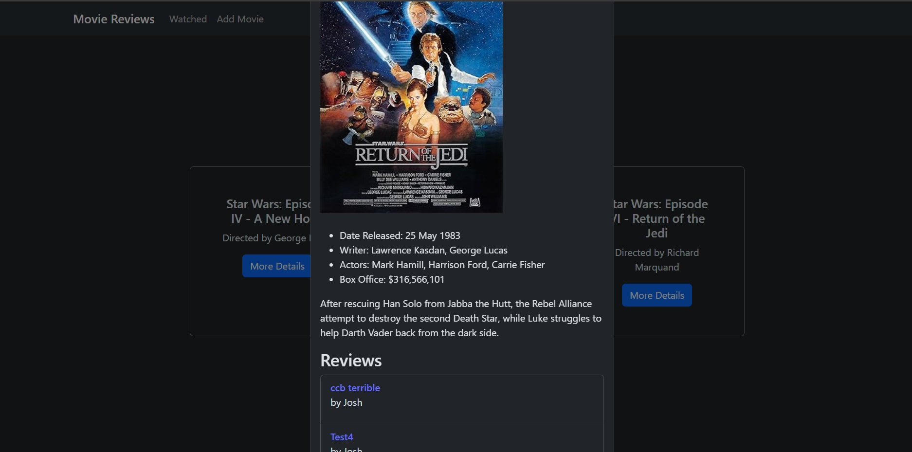

# Developing a React App with CRUD - Movie Reviews

## Project Brief

**MVP**

- The app is built with React with at least
    - 5 components
    - 4 props
    - 2 useStates
    - 2 react router routes
    - 1 lifting state, which is used to implement CRUD on the client side

- The app calls an API and displaying the data for the user. You may use any API of your choosing or [Find an available API here](https://github.com/public-apis/public-apis)

- The app's files are organized following the conventions taught in lectures.

- The app has at least 1 CUD (Create, Update, Delete) functionality using Airtable (but NOT the airtable client)
- The app is deployed online so that the rest of the world can use it.

## Movie Reviews

This app allows the user to search for movies and add it to the list of watched movies. If the movie is already in the list, the user will be informed. When viewing the list of watched movies, the user can then browse the reviews for the movie or add their own review. 

Due to unforseen circumstances, I was not able to spend as much time as I would have liked on the project and defaulted to an API that I knew would work off the bat.

Check out the demo at my [deployed page](https://josh-movie-reviews-demo.netlify.app/).

## Screenshots

## Technologies Used

- [React](https://react.dev/)
    - [React Router](https://reactrouter.com/en/main)
    - [React Bootstrap](https://react-bootstrap.netlify.app/)
    - [Vite](https://vitejs.dev/)

- Git / Github

- Deployed via [Netlify](https://www.netlify.com/)

- [Bruno](https://www.usebruno.com/) - API Client

- APIs used
  - [OMDb](https://www.omdbapi.com/)
  - [Airtable](https://airtable.com/)

## References

Favicon generated by [favicon.io](https://favicon.io/favicon-generator/).

Technical issues were solved mostly by the React and React Boostrap documentation, alongside [MDN Web Docs](https://developer.mozilla.org/en-US/).

## Description

This app was designed and implemented with the tools and concepts I learned while attending the Software Engineering Bootcamp at General Assembly (Singapore).

I will be sharing some reflections I had while building the project.

## User Stories

- As a user, I want to see the list of movies I have watched.
- As a user, I want to be able to add to the list of movies I have watched.
- As a user, I want to see detailed information of the movies.
- As a user, I want to be able to view the reviews available for a movie.
- As a user, I want to be able to add a review for a movie.
- As a user, I want to be able to delete my reviews.

## State Management

The primary state to manage are the data from the APIs, which are the movie details, as well as the reviews. For the purposes of the demo, the list of watched movies is temporary, with a set default.

Aside from fetching data, the main state to manage will be the controlled forms, both for adding a review as well as searching. I have opted to use modals for displaying movie details and thus need a state to control the rendering of the modal as well.

## Reflections

To be honest, this app isn't exactly what I would have liked to build, but circumstances led to being unable to commit as much time to planning as I would have liked. To some extent, this resulted in the removal of at least 2 components, and having to redesign how I was passing data through the app.

***Planning is crucial!***

Not sure if I have become better at this or if React is just that much easier to use compared to using HTML/CSS/Js, but I found execution simpler compared to my [Unit 1 Project - Checkers](https://github.com/siegefried/ga-unit1-checkers-game).

The points I ended up being really frustrated were not so much the challenges in coding, but...
- Bruno failing majority of the requests from the API suddenly, citing that Authorisation was needed. I hadn't changed anything and I eventually "solved" it by cloning a working request and editing the clone, even though I checked that everything else matched. 

- The above led me to spend a long time trying to fix a related problem, which made me really panic as I had no idea what to do.

Code wise, the most challenging issue was React's useEffect triggering twice. The other main solution I used to implement the logic flow I wanted was to use the useLocation hook. We did not go through it in class and I'm not sure if this is the "right" way, but it was fun getting it to work.

Compared to the previous project, I found myself reading way more than typing...

***We are likely to encounter unexpected problems beyond just coding.***

We only had 2 weeks with React before starting the project but I have really grown to appreciate the convenience React and other libraries offer. At the same time, I have also gained an appreciation of how much more there is that we have to learn, especially when taking into consideration how React wants us to think. While I'm sure some paradigms will likely be repeatable patterns, there's likely many "valid" approaches one could take.

***Learning is the foundation of a software engineer***

## Future Development

As this was created for project submission and there is likely a lot more coding and learning to do, I am unsure if there will be further iterations. To be honest, this isn't the entirety of what I planned, I wanted to include

- Editing the review
- Upvote function (for reviews)
- Star rating (when writing a review)
- Simulation of multiple users

Ran out of time before I could implement them, though the latter two should be more straightforward to implement.

